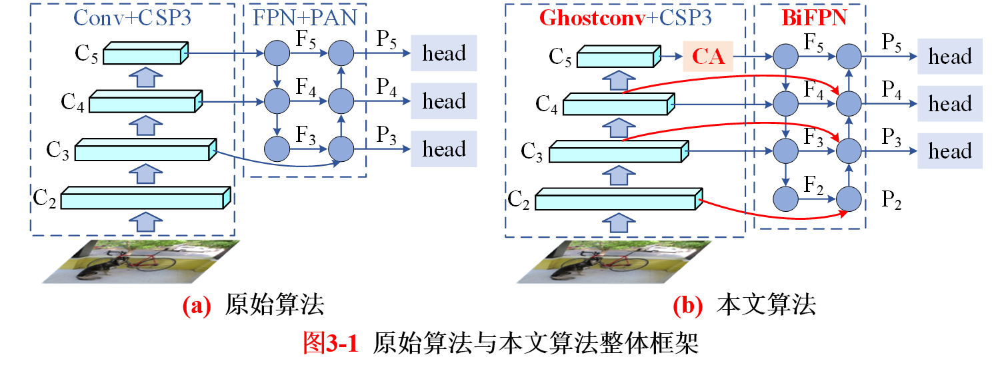

# YOLOv5-Abnormal-Driving

> 山东大学-本科毕设-基于深度学习的异常行为检测算法研究
>
> Author: 嗜睡的篠龙
>
> Email: 442082944@qq.com

对YOLOv5算法的4种改进方案：

- 引入轻量化卷积Ghostconv，大大降低了模型参数量；
- 引入BiFPN，并充分利用中小型目标检测层；
- 引入CA注意力机制，使得模型对目标框的定位更精确；
- 将CIoU替换为Alpha-EIoU，使得模型在不引入额外参数的情况下，检测精度得到大幅提升。

更多细节见：https://blog.csdn.net/weixin_43799388?spm=1000.2115.3001.5343
